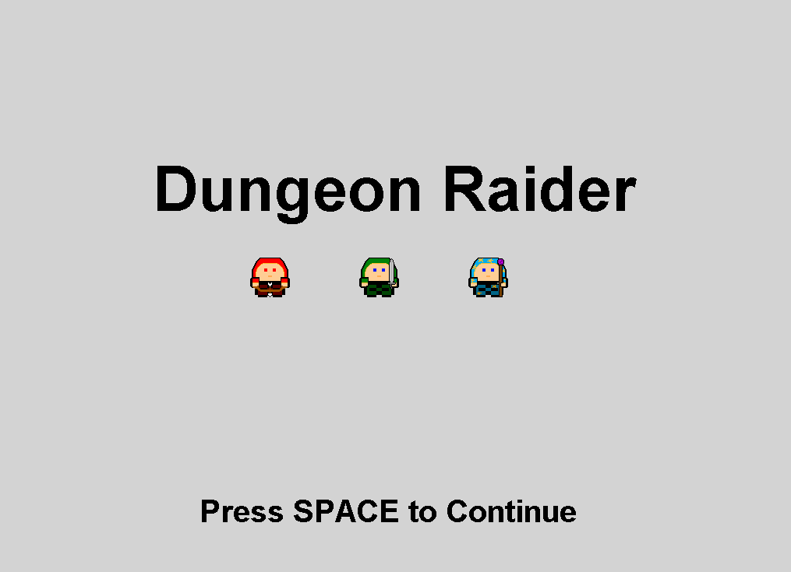
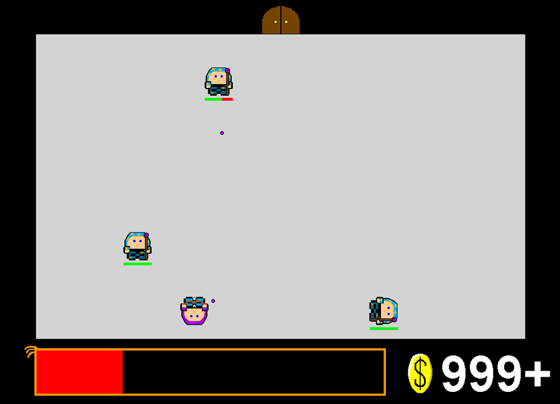
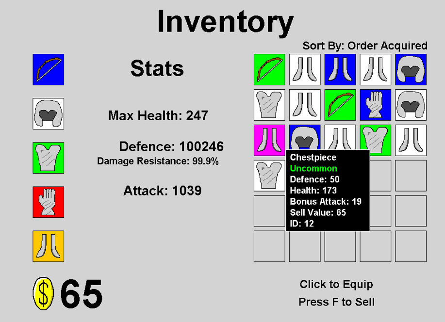
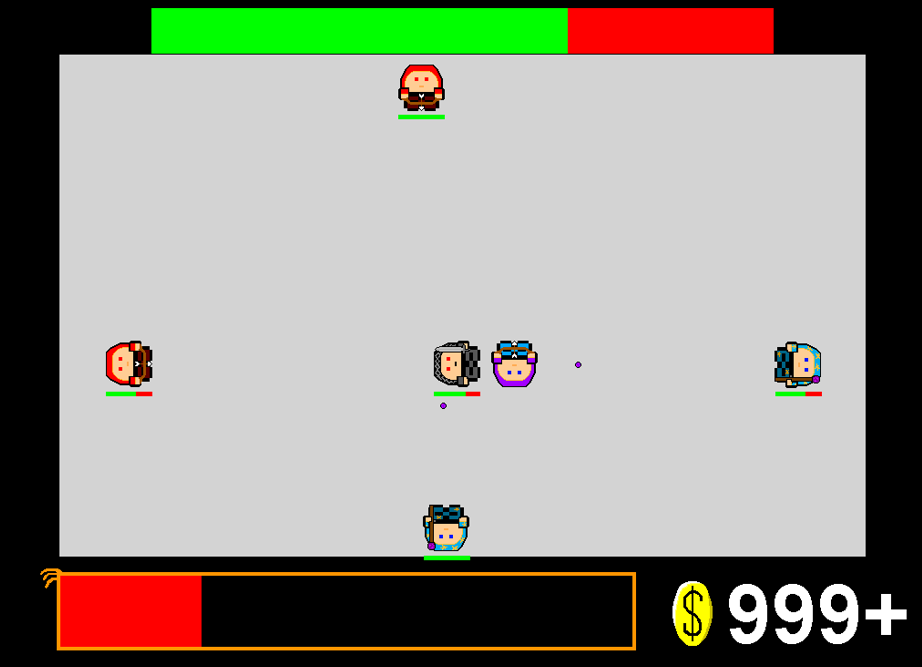

# Dungeon Raider
This is a small 2D dungeon looter game I made in Java for my Grade 12 computer Science Final project (2020). It was the project that made me want to go to University for Computer Science. I had only written my first line of code 6 months prior, and it was a big project for me at the time. 

This project uses the Java Graphics 2D library for drawing to the screen.

Looking back now, the code is not very good at all, but to me that just shows how much I've improved since then.

The FinalProject folder is a NetBeans project, but the source code is in FinalProject/src/finalproject/.

The repo includes a compiled version of the game. It is FinalProject/FinalProject.jar. In order for the media assets to load, the PNG and WAV folders must be in the same directory as the JAR.

The art assets don't look very pleasing because I made them all myself.

The sound effects were generatted with SFXR.

# Screenshots

